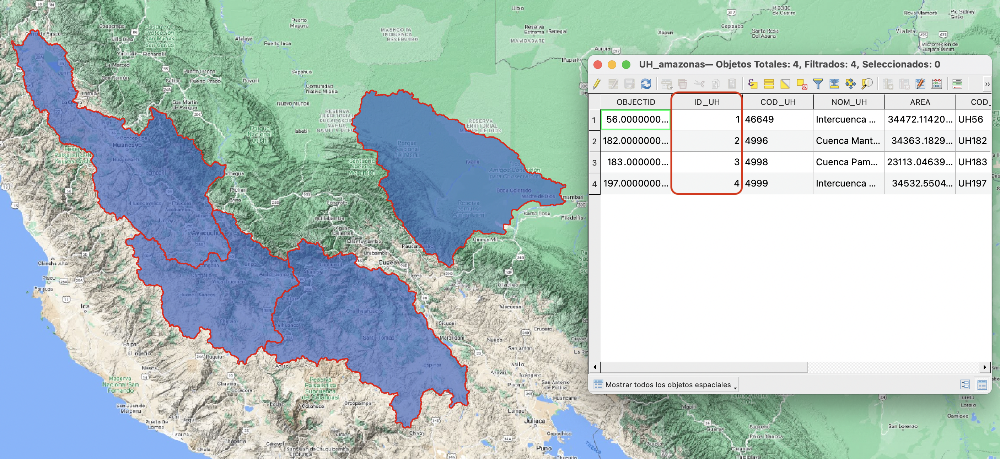
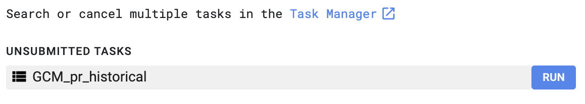

# GCM-CMIP6-Extract-pcp-base
 
El presente código se ha desarrollado de manera didáctica y para su uso académico, su uso está totalmente libre al publico y solo se requiere citar al autor, ¡muchas gracias!

Atentamente: 

Kevin Arnold Traverso Yucra / Ing. Agrícola

## Primeros pasos

Para empezar a utilizar el scrip desarrollado para la plataforma de GOOGLE EARTH ENGINE, puedes entrar al link para registrarte [https://earthengine.google.com](https://earthengine.google.com), es necesario haberse creado una cuenta y crear un script vacío donde usted pueda pegar el código.

El código está dividido en cuatro secciones cada una se describe a continuación:

1. Asignación de cuencas para obtener la información.

2. Extraer los datos de precipitaciones Históricas en promedio areal de los modelos CMIP-6.

3. Representación de los modelos extraídos visualmente (Grafico areal y serie de tiempo).

4. Proceso de exportación a Google Drive para su descarga.

## Empleo del script

A partir de los cuatro puntos es posible utilizar el código para muestras zonas de interés, cabe señalar que el codigo se encuentra en desarrollo y por el momento solo se puede descargar los datos historicas de precipitaciones (1950 - 2014) que están a paso de tiempo diario.

### Configuracion de shapefile de cuencas

Primeramente, el shapefile de cuencas debe estar georreferenciado en WGS84(4326), en formato de polígono, del mismo modo, este shapefile necesita una codificación interna que debe encontrarse en formato integer (entero) para extraer la información de manera independiente, en este caso esta denominado 'ID_UH'.

Es posible cargar el shapefile de cuencas al GEE, y agregarlo al script con la siguiente sentencia:

```
var HidroCuenca = ee.FeatureCollection("projects/ee-arnoldtraverso/assets/UH_amazonas");
```



#### Asignacion de modelos GCM

En esta siguiente parte el codigo, muestra todos los modelos que se tienen en la base de datos para los CMIP-6, de manera de ejemplo se encuentra desactivado los modelos 'ACCESS-CM2' y 'ACCESS-ESM1-5', es posible activar todos los modelos, pero requiere un mayor costo computacional

```
var listModel = ['ACCESS-CM2', 'ACCESS-ESM1-5'
                 //'BCC-CSM2-MR', 'CESM2', 'CESM2-WACCM', 'CMCC-CM2-SR5',
                 //'CMCC-ESM2', 'CNRM-CM6-1', 'CNRM-ESM2-1', 'CanESM5', 'EC-Earth3', 'EC-Earth3-Veg-LR',
                 //'FGOALS-g3', 'GFDL-CM4', 'GFDL-ESM4', 'GISS-E2-1-G', 'HadGEM3-GC31-LL', 'HadGEM3-GC31-MM',
                 //'IITM-ESM', 'INM-CM4-8', 'INM-CM5-0', 'IPSL-CM6A-LR', 'KACE-1-0-G', 'KIOST-ESM',
                 //'MIROC-ES2L', 'MIROC6', 'MPI-ESM1-2-HR', 'MPI-ESM1-2-LR', 'MRI-ESM2-0', 'NESM3',
                 //'NorESM2-LM', 'NorESM2-MM', 'TaiESM1', 'UKESM1-0-LL'
                 ];
```

### EXTRACCION DE DATOS

En las siguientes partes del código, se realiza el proceso de extracción este proceso se realiza para cada unidad hidrográfica, después se ha realizado el ingreso de manera visual del último modelo que se ha ejecutado, esto con fines didácticos del código y también la visualización de las cuencas.


Finalmente usted tiene que dirigirse a la pestaña de 'Task' en GEE para poder enviar el archivo que se ha generado en formato CSV a su Google Drive Personal, para poder descargar la informacion de su interes.



